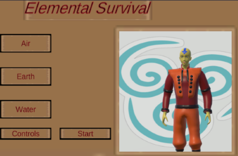

# Elemental Survival

## Hugo Roben
#### 13424718

### Beschrijving
Elemental survival is een third person shooter, gebaseerd op Avatar: The legend of Aang. In de game speel je met Aang, of een soldaat uit het aarderijk tegen de soldaten van de vuurnatie. De game speelt af in rondes. De speler begint met de wateraanval en kan door de rondes heen items oppakken om zo ook de lucht en vuuraanval te krijgen!\
Het spel is bedoeld voor jongeren die houden van third person shooters en affiniteit hebben met de serie Avatar: The legend of Aang. De game tracht de speler terug te brengen naar het gevoel en de tijd van Avatar: The legend of Aang. Zo kan de speler met Aang zelf spelen en zijn de tegenstanders precies zoals in de serie zelf.\
Het doel van het spel is om zoveel mogelijk rondes te overleven en daarbij zoveel mogelijk kills te verzamelen. De rondes van de game worden moeilijker naarmate de game vordert. Er spawnen meer enemies en per ronde zijn er meer enemies die op de speler schieten, in tegenstelling tot de wat makkelijkere enemies die alleen op de speler afrennen en deze proberen te slaan. De speler kan zich voortbewegen door te lopen, sprinten of rollen. Voor het spelen van de game is het sterk aangeraden dat de speler beschikt over een externe muis. 

### Controls:
- WASD: rondlopen
- linker-shift: sprinten
- spatie: rollen
- linker muisknop: schieten
- E: pauzemenu

### Features:
- Aang-karakter (speelbaar)
- Aarderijk soldaat (speelbaar)
- Vuurnatie-soldaat (enemy)
- Drie verschillende aanvallen (lucht, aarde, water)
- Vuuraanval voor de enemies
- minimap
- Battle arena in vuurnatie-style
- Karakterselectie-menu
- Pauze-menu

### Screenshots

 \
 

### Instructies voor het installeren
Om te openen in Unity is versie 2021.3.32 of nieuwer nodig: https://unity.com/releases/editor/whats-new/2021.3.32\
<<<<<<< HEAD
- Download de volledige `Project` map
- Ga in Unity Hub naar add -> project from disk -> selecteer de map met dit project er in.
=======
- Download de volledige repository
- Ga in Unity Hub naar add -> project from disk -> selecteer de map met dit project er in.\

Voor het spelen van de laatste build:
- Download de map `builds` -> open `ElementalSurvival.exe`
>>>>>>> fe62b33e0b64134a2ecfd9fb2894ffbfb67925f0

### Bronvermelding en dankbetuiging

- De code in `HealthManager.cs` is deels copyright Code Monkey, 2018 (https://www.youtube.com/watch?v=0T5ei9jN63M). (De code uit PlayerHealthmanager.cs deels ook)
- De code uit `Inventory.cs`, `Item.cs`, `ItemPickUp.cs`, `InventorySlot.cs` en `InventoryUi.cs` is deels copyright Brackeys, 2017 (https://www.youtube.com/watch?v=HQNl3Ff2Lpo)
- De animaties uit de game zijn copyright Blink, 2022 (https://assetstore.unity.com/packages/3d/animations/free-32-rpg-animations-215058)
- De texture voor de steen aanval is copyright PolyHaven, 2020 (https://polyhaven.com/a/aerial_grass_rock)
- De zand-texture van het terrein is copyright textures.com, 2021 (https://www.textures.com/category/rock/349)
- De achtergond van de karakters in main menu zijn copyright redbubble.com, 2021
- De bruine afbeelding gebruikt in main menu, pauzemenu, inventory balk en game-over menu is copyright Pogle, 2023
- De vuurnatie afbeelding op de vlaggen in de arena is copyright Abullah Mohammed (https://nl.pinterest.com/pin/519602875760850604/)
- Embleem voor luchtaanval is copyright Shutterstock (https://www.shutterstock.com/nl/image-vector/smoke-cloud-explosion-dust-puff-cartoon-1091493323)
- Embleem voor aarde-aanval is copyright VectorStock (https://www.vectorstock.com/royalty-free-vector/rock-stone-boulders-cartoon-isometric-vector-35351659)
- Embleem voor water aanval is copyright ICONSDB.com (https://www.iconsdb.com/blue-icons/water-icon.html)

#### Playthrough embed:
<iframe id="kaltura_player" src="https://api.eu.kaltura.com/p/120/sp/12000/embedIframeJs/uiconf_id/23449960/partner_id/120?iframeembed=true&playerId=kaltura_player&entry_id=0_7yihimq7&flashvars[streamerType]=auto&amp;flashvars[localizationCode]=en_US&amp;flashvars[sideBarContainer.plugin]=true&amp;flashvars[sideBarContainer.position]=left&amp;flashvars[sideBarContainer.clickToClose]=true&amp;flashvars[chapters.plugin]=true&amp;flashvars[chapters.layout]=vertical&amp;flashvars[chapters.thumbnailRotator]=false&amp;flashvars[streamSelector.plugin]=true&amp;flashvars[EmbedPlayer.SpinnerTarget]=videoHolder&amp;flashvars[dualScreen.plugin]=true&amp;flashvars[hotspots.plugin]=1&amp;flashvars[Kaltura.addCrossoriginToIframe]=true&amp;&wid=0_x3cyxvw2" width="400" height="261" allowfullscreen webkitallowfullscreen mozAllowFullScreen allow="autoplay *; fullscreen *; encrypted-media *" sandbox="allow-downloads allow-forms allow-same-origin allow-scripts allow-top-navigation allow-pointer-lock allow-popups allow-modals allow-orientation-lock allow-popups-to-escape-sandbox allow-presentation allow-top-navigation-by-user-activation" frameborder="0" title="screencast"></iframe>

