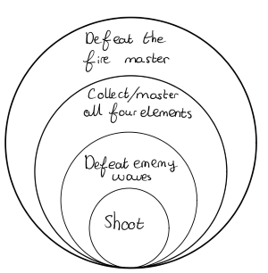
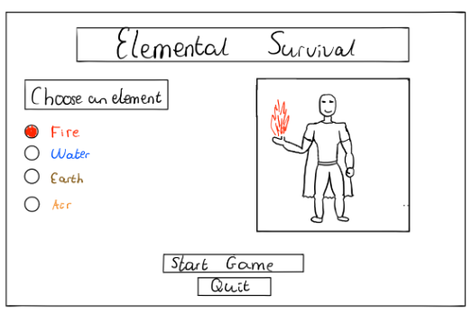
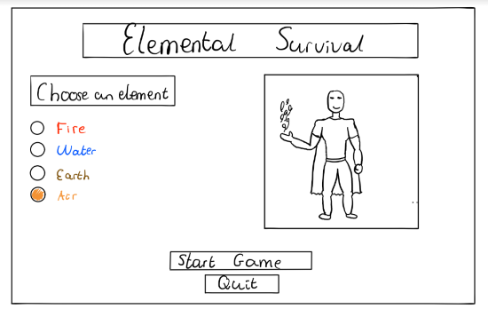
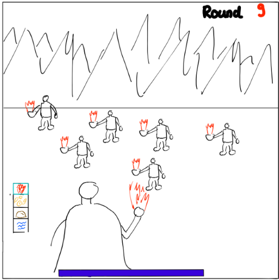

# Elemental Survival
### _ELemental Survival is een survival game waarin jij als beheerser van alle vier de elementen vecht tegen golven van tegenstanders. Sla alle vijanden van je af, en leer door de game heen alle elementen te besturen om zo onverslaanbaar te worden!_

#### Hugo Roben, 13424718

## scope:
De scope ligt op het visuele design van de game. Ik wil leren om 3d karakters te maken. Het doel van dit project is om een game te maken waarin de visuele aspecten van alle vier de elementen naar voren komen. Net als in de serie Avatar: de legende van Aang wil ik voor elke element een karakter maken waarmee gespeeld kan worden, en een ontwerp voor de aanval behorend bij elk element. Optioneel wil ik ook verschillende enemies maken behorend bij alle vier de elementen.  

De verwachte gebruikers voor dit project zijn: 
- Ik zelf
- Kennissen en vrienden die geïnteresseerd zijn in zowel avatar als survival games.

De game wordt gespeeld op een computer met een muis en toetsenbord. Voor het spelen van de game is een muis nodig, met een makkelijk te gebruiken linker en rechtermuisknop.
De game wordt ontworpen voor fans van de serie Avatar: De Legende van Aang, de focus van de game ligt op het visuele design in de stijl van deze serie. De game is hierdoor het aantrekkelijkst voor mensen die affiniteit hebben met deze serie en het hierdoor leuk vinden een game te spelen die op eenzelfde wijze omgaat met de vier elementen en gevechtswijze uit de serie. Denk hierbij aan het schieten van een vuurbal of een stuk aarde (afhankelijk van het gebruikte element).

In de game begint de speler met het gekozen element (zie de schets van het main menu). Bij het starten van de game komen de eerste golven van tegenstanders. Naarmate de game vordert spawnen er in de map items die de speler op kan pakken en kan selecteren. Deze items zijn te vergelijken met het oppakken van bijvoorbeeld een nieuw geweer in Call of Duty zombies. Door het oppakken van de wapens unlockt de speler een nieuw element, en de speler kan vervolgens de aanval gebruiken die bij dit element hoort. Het doel van het spel is in eerste instantie om simpelweg zoveel mogelijk rondes te overleven, in een later stadium wil ik een eindbaas toevoegen die het einde van het spel markeert.

## Core mechanic diagram:

## Hoofdmenu schets
 

## In game schets
\
Voor de controlls wil ik 'WASD' gebruiken als basis om de speler rond te laten lopen. De speler kan een aanval uitvoeren met de linker muis knop, de speler kan sprinten door op shift te drukken, 
en de speler kan springen door op spatie te drukken. De speler beweegt door de itembalk heen met het muiswiel. In het geval ik toekom aan het toevoegen van een hongerstatus voor de speler en elixir items die spawnen om de honger op te lossen, kan dit via dezelfde controlls als een aanval uitgevoerd worden. Optioneel is ook om de speler de camera rond kan laten draaien en hiermee als het ware om zich heen te laten kijken, dit kan door de rechtermuisknop ingedrukt te houden. 
Onderin het beeld wat de speler ziet in de game is de balk waarop de levens van de speler te zien nzijn. Als de speler damage ontvangt dan wordt de balk leger. Als de balk helemaal leeg is, Links in beeld zijn de items te zien die de speler tot zijn of haar beschikking heeft. Ook is in deze balk huidig geselecteerde item van de speler te zien.

## Essentiële features
- Speler kan springen, lopen en rennen
- Speler kan schieten/ een aanval uitvoeren
- Er spawnen vijanden in golven
- De vijanden spawnen op een vaste plek
- De vijanden vallen de speler aan door middel van melee aanvallen
- De game houdt bij welke ronde de speler in zit
- De speler en de vijanden hebben een hoeveelheid levens
- De speler heeft een balk met de hoeveelheid levens
- De speler herstelt automatisch van damage die gedaan is door vijanden
- Vijanden kunnen damage krijgen en hierdoor doodgaan
- Game camera volgt de speler
- De vier elementen, vuur, water, aarde en lucht zijn beschikbaar in het spel. Het doel is om deze elementen vindbaar te maken tijdens het spelen van de game. Mocht dit niet haalbaar zijn dan moet de speler vanaf het begin alle vier de elementen kunnen gebruiken. 
- De aanval van elk element heeft een ander uiterlijk. 
- Speler kan switchen tussen aanvallen/elementen. Dit houdt in dat er een menu in het scherm aanwezig is waar de beschikbare elementen in staan, en waarin duidelijk wordt, welk element op het moment geselecteerd is.
- De vijanden verschillen in uiterlijk, behorend bij de vier elementen
- De aanvallen van de speler verschillen in effectiviteit op basis van het gekozen element, en het element van de vijand in kwestie. 
- HUD
## Optionele features
- De golven van vijanden worden moeilijker te verslaan naarmate de game vordert
- Speler kan de positie van de camera aanpassen (om zich heen kijken)
- De vijanden kunnen op verschillende plekken in de game spawnen
- Er spawnen nieuwe elementen/ aanvallen in de game
- Speler kan nieuwe elementen/ aanvallen oppakken
- De speler kan verschillende karakters kiezen om mee te spelen, gebaseerd op de elementen. 
- De vijanden vallen aan door middel van elementen af te vuren/ dezelfde soort aanvallen als de speler uitvoert.
- De vijanden verschillen in sterkte aan de hand van de ronde van de game
- De vijanden bewegen sneller aan de hand van de ronde van de game 
- Er spawnen elixir items
- De speler kan elixir items oppakken en selecteren
- De speler herstelt in levens door elixir items te drinken
- De vijanden vallen anders aan, aan de hand van het element van de vijanden
- Er is een eindbaas (de vuurmeester) na de laatste ronde
- Het verslaan van de eindbaas is het einde van het spel

## Asset packs
Om te kunnen focussen op het grafische aspect en het schrijven van de game zelf ga ik asset packs gebruiken voor de animaties van de speler en de vijanden.
- Speler bewegingen/ aanvallen: 
    -  https://assetstore.unity.com/packages/3d/animations/free-32-rpg-animations-215058
    - https://assetstore.unity.com/packages/3d/animations/warrior-pack-bundle-2-free-42454#content
    - https://assetstore.unity.com/packages/3d/animations/fighter-pack-bundle-free-36286
- Vijand bewegingen:
    - https://assetstore.unity.com/packages/3d/animations/melee-warrior-animations-151650 (niet gratis, optioneel)
- Blender
- Cinemachine in unity

## Eventuele moeilijkheden
De grootste moeilijkheid is afwegen waar ik op wil focussen. Een simpele game schrijven met rondes van tegenstanders moet in een korte tijd te doen kunnen zijn, om hierna te kunnen focussen op het grafische design. Dingen die mogelijk kunnen zijn, zijn:
- De tegenstanders in de game werken niet goed of te simpel, hierdoor heeft de speler niet het idee een volwaardige game te spelen.
- Het grafisch ontwerpen van de karakters en aanvallen kost te veel tijd.
- De animaties uit de asset packs sluiten niet goed aan op het grafisch design dat ik voor ogen heb.
- de game heeft geen goede progressie. Hiermee bedoel ik dat door te weinig tijd om te focussen op de gameplay de game niet voldoende uitdaging geeft om door te willen spelen. Dit probleem kan in ieder geval deels opgelost worden door het grafische design goed aan te pakken, als alle vier de elementen in de game zitten en er mooi uit zien, heeft de speler een reden om die in ieder geval te verzamelen. 

## Thema
Moodboard met afbeeldingen waar ik mn inspiratie vandaan ga halen. 

