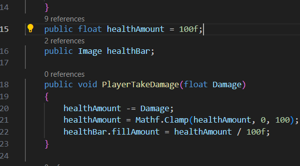
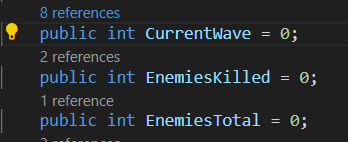
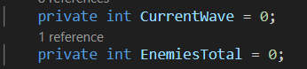
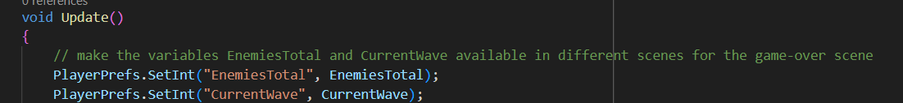
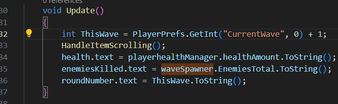
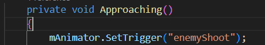
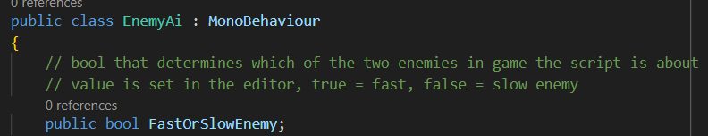
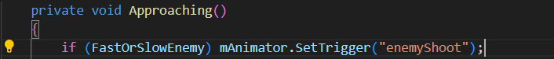

## Namen mede-studenten: 
- Rembrand Ruppert
- Ties Veltman

## Eerste verbeterpunt: Alle variabelen declareren bovenaan script.
Het tegengekomen probleem is dat ik in veel van de wat langere scripten niet alle variabelen bovenaan het script heb gedefinieerd, maar dat er boven losse functies variabelen declaraties staan die met de bijbehorende functie te maken hebben. Dit zorgt ervoor dat de code niet lekker leesbaar is, aangezien er steeds geschakeld wordt van functies naar stukken waarin variabelen gedeclareerd worden.\
De afweging die ik hierbij moet maken is of de code overzichtelijker wordt van alles bovenaan declareren, of dat het juist minder duidelijk wordt welke variabelen welke functie hebben. In kleine scripten is dit geen probleem, aangezien het makkelijker af te leiden is wat elke variabele doet als er maar weinig variabelen zijn.\
Ik heb ervoor gekozen om variabelen die veel terugkomen in een script bovenaan te declareren. Dit zijn bijvoorbeeld variabelen die in meerdere functies gebruikt worden. variabelen die specifiek gemaakt zijn voor, en alleen gebruikt worden door, een enkele functie heb ik boven de desbetreffende functie gezet. Doordat er nu geen variabelen bovenaan het script staan die pas veel later in het script gebruikt zijn is het makkelijker voor een andere lezer van de code om te achterhalen welke varaiabelen welke functie heeft.

Hier zijn enkele voorbeelden van hoe de code eruit zag voor het aanpassen van de declaraties (het belanrgijkste hier is de regelnummers naast de regels, hieruit is op te maken hoe ver in het script de variabelen worden gedefinieerd): 

\
\
Hierboven is de variabele 'rotationSpeed' gedfinieerd boven de functie ShootAtPlayer(). De variabelen wordt echter eerder in het script ook gebruikt in de Attacking() functie. Dit is een goed voorbeeld van wanneer het beter is om de variabele te declareren bovenaan het script. 
De rest van de variabelen in de afbeelding zijn variabelen die enkel gebruikt worden in ShootAtPlayer(). Voor deze variabelen kies ik er dan ook voor om ze te laten staan op de plek waar ze staan. \
\
\
Hierboven is te zien hoe in WaveSpawner.cs na de start() functie vier variabelen aangemaakt worden. Deze variabelen worden op verschillende plekken in het script gebruikt, deze variabelen kunnen hierom beter gedeclareerd worden aan het begin van het script.\
\
\
Hierboven staat een voorbeeld van een stuk code waarbij het overzichtelijker is om de variabelen boven de functies te declareren. De variabelen in kwestie worden enkel gebruikt door de twee kleine functies eronder, die de item spawnen waar je nieuwe aanvallen mee kan oppikken.\
\
\
Hierboven is te zien hoe in PlayerHealthManager.cs de variabelen healthAmount en healthBar pas na de Update functie gedefinieerd worden. Deze variabelen worden in de update functie zel al gebruikt dus in dit geval is het voor de leesbaarheid beter om de variabelen aan het begin van het script te definieren.

## Tweede verbeterpunt: Public variables die private kunnen zijn private maken.

In veel scripts heb ik (bijna) alle variabelen gedefinieerd als public. Het probleem is dat alle variabelen als public zijn gedeclareerd, waardoor ze direct toegankelijk zijn vanuit andere scripts. Dit leidt tot gebrek aan encapsulatie, wat kan resulteren in onverwachte wijzigingen aan de staat van de klasse door externe scripts. Het kan ook de leesbaarheid van de code verminderen en het onderhoud bemoeilijken.\
Om dit probleem op te lossen, kun je variabelen prive maken en met een Getter/Setter methode de variabelen bereikbaar maken in andere scripts, zonder dat de mogelijkheid er is dat andere scripts de variabelen ongewild aanpassen.\
De afweging gaat over het beheren van toegang tot de interne staat van een klasse. Door variabelen als public te maken, is er gemakkelijke toegang vanuit andere scripts, maar dit gaat ten koste van controle van de variabelen. De afweging is tussen gemakkelijke toegang en controle over hoe variabelen worden gelezen en gewijzigd.\
\
\
Hierboven is een voorbeeld te zien van variabelen die alleen in het script WaveSpawner.cs gewijzigd mogen worden, maar omdat de waardes van de variabelen nodig zijn in andere scripts, als public gedefinieerd zijn. Het betreft de variabelen CurrentWave en EnemiesTotal. Hierbij is het handig om Getter/Setter methodes te gebruiken:\
\
Met de Getter/Setter methodes:\
\
\
Deze variabelen kunnen dan als volgt gebruikt worden in andere scripts (in dit voorbeeld InventoryUi.cs):
\

## Derde verbeterpunt: Scripts die vrijwel hetzelfde doen, samenvoegen naar een enkel script.

Het probleem is dat er scripts zijn die vergelijkbare functionaliteiten uitvoeren. Dit kan leiden tot code duplicatie, waardoor onderhoudsproblemen ontstaan, zoals het moeten bijwerken van dezelfde logica in meerdere scripts en het risico op inconsistenties tussen die scripts. Ook is het voor eventuele andere developers moeilijker om de code over te nemen en zelf verder aan te werken. Het is voor mij nu duidelijk welk script wat doet en waarom er twee scripts zijn, voor iemand die het project voor het eerst bekijkt is dit minder vanzelfsprekend.\
De manier waarop dit aangepakt kan worden is de scripts samen te voegen. Het betreft in mijn project de scripts 'EnemyAi.cs' en 'EnemyAiFast.cs'. In de game zijn er twee soorten enemies, die nu beiden bestuurd worden vanuit een ander script. Het enige verschil tussen de scripts is echter dat de ene enemy schiet op de speler en iets langzamer is.\
De afweging bij het samenvoegen van vergelijkbare scripts is tussen het verminderen van duplicatie en het behouden van modulariteit. Hoewel het samenvoegen de onderhoudslast vermindert, kan het ook leiden tot een grotere scriptomvang en minder modulariteit.\
\
Momenteel zijn er twee scripts. Afbeeldingen toevoegen van het hele script gaat hier aan het doel voorbij, dus hieronder zijn de afbeeldingen toegevoegd waarin de logica te zien is die gebruikt is om de twee enemies met een script aan te sturen. In het oude script voor de enemy die schiet op de speler, is in de Approach() method deze line toegevoegd:\
\
\
Hiermee wordt de schiet animatie getriggerd terwijl de enemy op de speler af loopt. Voor de rest is het enige verschil tussen de twee scripts dat de snelheid anders is, en dat de attack-en-sightrange anders zijn. Dit zijn echter variabelen die in de unity editor afgesteld kunnen worden. Door bovenaan het script een publieke bool toe te voegen die aanduidt om wat voor enemy het gaat, is de rest van de veranderingen ook makkelijk met zich mee te brengen:\
\
\
\
\
## Vierde verbeterpunt: in PlayerAnimations.cs een state-machine maken voor de animaties net als in EnemyAi.cs

