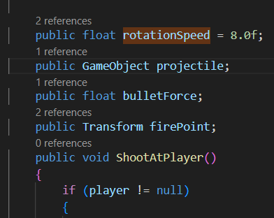
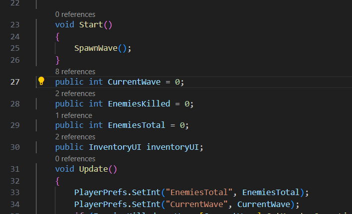
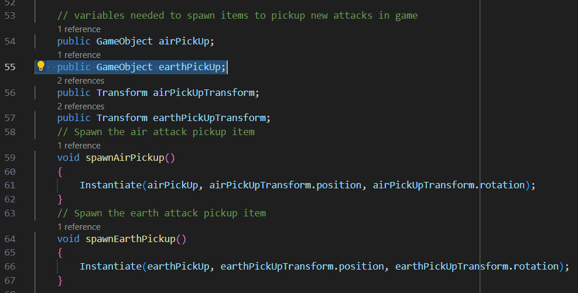

## Namen mede-studenten: 
- Rembrand Ruppert
- Ties Veltman

## Eerste verbeterpunt: Alle variabelen declareren bovenaan script.
Het tegengekomen probleem is dat ik in veel van de wat langere scripten niet alle variabelen bovenaan het script heb gedefinieerd, maar dat er boven losse functies variabelen declaraties staan die met de bijbehorende functie te maken hebben. Dit zorgt ervoor dat de code niet lekker leesbaar is, aangezien er steeds geschakeld wordt van functies naar stukken waarin variabelen gedeclareerd worden.\
De afweging die ik hierbij moet maken is of de code overzichtelijker wordt van alles bovenaan declareren, of dat het juist minder duidelijk wordt welke variabelen welke functie hebben. In kleine scripten is dit geen probleem, aangezien het makkelijker af te leiden is wat elke variabele doet als er maar weinig variabelen zijn.\
Ik heb ervoor gekozen om variabelen die veel terugkomen in een script bovenaan te declareren. Dit zijn bijvoorbeeld variabelen die in meerdere functies gebruikt worden. variabelen die specifiek gemaakt zijn voor, en alleen gebruikt worden door, een enkele functie heb ik boven de desbetreffende functie gezet. Doordat er nu geen variabelen bovenaan het script staan die pas veel later in het script gebruikt zijn is het makkelijker voor een andere lezer van de code om te achterhalen welke varaiabelen welke functie heeft.

Hier zijn enkele voorbeelden van hoe de code eruit zag voor het aanpassen van de declaraties (het belanrgijkste hier is de regelnummers naast de regels, hieruit is op te maken hoe ver in het script de variabelen worden gedefinieerd): 

\
\
Hierboven is de variabele 'rotationSpeed' gedfinieerd boven de functie ShootAtPlayer(). De variabelen wordt echter eerder in het script ook gebruikt in de Attacking() functie. Dit is een goed voorbeeld van wanneer het beter is om de variabele te declareren bovenaan het script. 
De rest van de variabelen in de afbeelding zijn variabelen die enkel gebruikt worden in ShootAtPlayer(). Voor deze variabelen kies ik er dan ook voor om ze te laten staan op de plek waar ze staan. \
\
\
Hierboven is te zien hoe in WaveSpawner.cs na de start() functie vier variabelen aangemaakt worden. Deze variabelen worden op verschillende plekken in het script gebruikt, deze variabelen kunnen hierom beter gedeclareerd worden aan het begin van het script.\
\
\
Hierboven staat een voorbeeld van een stuk code waarbij het overzichtelijker is om de variabelen boven de functies te declareren. De variabelen in kwestie worden enkel gebruikt door de twee kleine functies eronder, die de item spawnen waar je nieuwe aanvallen mee kan oppikken.

