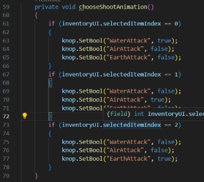
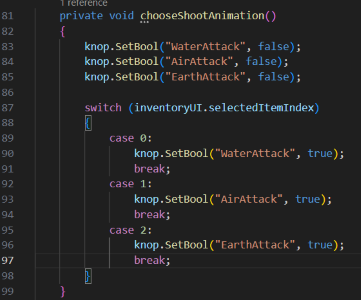
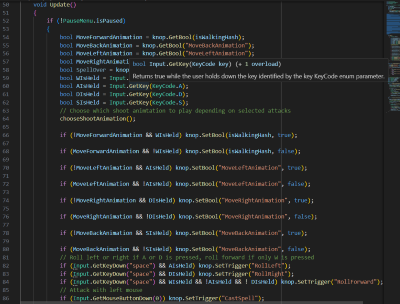
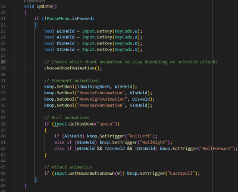
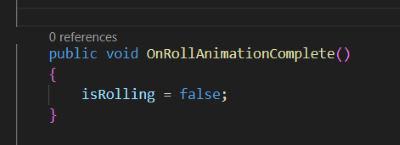
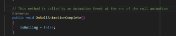
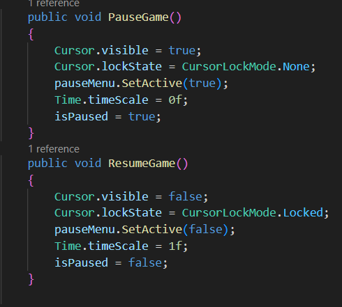
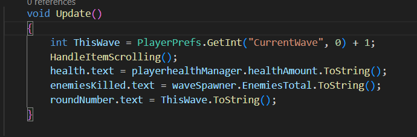
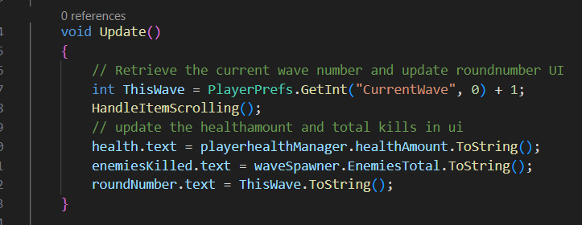
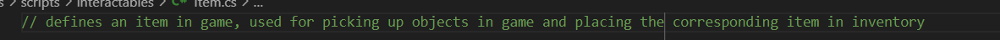

## Naam: Hugo Roben
### studentnummer: 13424718
### Naam project: Elemental Survival

### Namen mede-studenten: 
- Rembrand Ruppert
- Ties Veltman

## Eerste verbeterpunt: Alle variabelen declareren bovenaan script.
Het tegengekomen probleem is dat ik in veel van de wat langere scripten niet alle variabelen bovenaan het script heb gedefinieerd, maar dat er boven losse functies variabelen declaraties staan die met de bijbehorende functie te maken hebben. Dit zorgt ervoor dat de code niet lekker leesbaar is, aangezien er steeds geschakeld wordt van functies naar stukken waarin variabelen gedeclareerd worden.\
De afweging die ik hierbij moet maken is of de code overzichtelijker wordt van alles bovenaan declareren, of dat het juist minder duidelijk wordt welke variabelen welke functie hebben. In kleine scripten is dit geen probleem, aangezien het makkelijker af te leiden is wat elke variabele doet als er maar weinig variabelen zijn.\
Ik heb ervoor gekozen om variabelen die veel terugkomen in een script bovenaan te declareren. Dit zijn bijvoorbeeld variabelen die in meerdere functies gebruikt worden. variabelen die specifiek gemaakt zijn voor, en alleen gebruikt worden door, een enkele functie heb ik boven de desbetreffende functie gezet. Doordat er nu geen variabelen bovenaan het script staan die pas veel later in het script gebruikt zijn is het makkelijker voor een andere lezer van de code om te achterhalen welk functie een variabele heeft.

Hier zijn enkele voorbeelden van hoe de code eruit zag voor het aanpassen van de declaraties:
\
\
\
Hierboven is de variabele `rotationSpeed` gedfinieerd boven de functie `ShootAtPlayer()`. De variabelen wordt echter eerder in het script ook gebruikt in de `Attacking()` functie. Dit is een goed voorbeeld van wanneer het beter is om de variabele te declareren bovenaan het script. 
De rest van de variabelen in de afbeelding zijn variabelen die enkel gebruikt worden in `ShootAtPlayer()`. Voor deze variabelen kies ik er dan ook voor om ze te laten staan op de plek waar ze staan. \
\
\
Hierboven is te zien hoe in `WaveSpawner.cs` na de `Start()` functie vier variabelen aangemaakt worden. Deze variabelen worden op verschillende plekken in het script gebruikt, hierom kunnen deze variabelen gedeclareerd worden aan het begin van het script.\
\
\
Hierboven staat een voorbeeld van een stuk code waarbij het overzichtelijker is om de variabelen boven de functies te declareren. De variabelen in kwestie worden enkel gebruikt door de twee kleine functies eronder, die de item spawnen waar je nieuwe aanvallen mee kan oppikken.\
\
\
Hierboven is te zien hoe in `PlayerHealthManager.cs` de variabelen `healthAmount` en `healthBar` pas na `Update()` gedefinieerd worden. Deze variabelen worden in zowel `Update()` als in `PlayerTakeDamage()` gebruikt dus in dit geval is het voor de leesbaarheid beter om de variabelen aan het begin van het script te definieren.

## Tweede verbeterpunt: Public variables die private kunnen zijn private maken.

In veel scripts heb ik (bijna) alle variabelen gedefinieerd als public. Het probleem is dat alle variabelen als public zijn gedeclareerd, waardoor ze direct toegankelijk zijn vanuit andere scripts. Dit leidt tot gebrek aan encapsulatie, wat kan resulteren in onverwachte wijzigingen aan de staat van de klasse door externe scripts. Het kan ook de leesbaarheid van de code verminderen en het onderhoud bemoeilijken.\
Om dit probleem op te lossen, kun je variabelen prive maken en met een Getter/Setter methode de variabelen bereikbaar maken in andere scripts, zonder dat de mogelijkheid er is dat andere scripts de variabelen ongewild aanpassen.\
De afweging is tussen gemakkelijke toegang en controle over hoe variabelen worden gelezen en gewijzigd. Door variabelen als public te maken, is er gemakkelijke toegang vanuit andere scripts, maar dit gaat ten koste van controle van de variabelen.\
\
\
Hierboven is een voorbeeld te zien van variabelen die alleen in het script `WaveSpawner.cs` gewijzigd mogen worden, maar omdat de waardes van de variabelen nodig zijn in andere scripts, als public gedefinieerd zijn. Het betreft de variabelen `CurrentWave` en `EnemiesTotal`. Hierbij is het handig om Getter/Setter methodes te gebruiken:\
\
\
Met de Getter/Setter methodes:
\
\
\
Deze variabelen kunnen dan als volgt gebruikt worden in andere scripts (in dit voorbeeld `InventoryUi.cs`):

## Derde verbeterpunt: Scripts die vrijwel hetzelfde doen, samenvoegen naar een enkel script.

Het probleem is dat er scripts zijn die vergelijkbare functionaliteiten uitvoeren. Dit kan leiden tot code duplicatie, waardoor onderhoudsproblemen ontstaan, zoals het moeten bijwerken van dezelfde logica in meerdere scripts en het risico op inconsistenties tussen die scripts. Ook is het voor eventuele andere developers moeilijker om de code over te nemen en zelf verder aan te werken. Het is voor mij nu duidelijk welk script wat doet en waarom er twee scripts zijn, voor iemand die het project voor het eerst bekijkt is dit minder vanzelfsprekend.\
De manier waarop dit aangepakt kan worden is de scripts samen te voegen. Het betreft in mijn project de scripts `EnemyAi.cs` en `EnemyAiFast.cs`. In de game zijn er twee soorten enemies, die nu beiden bestuurd worden vanuit een ander script. Het enige verschil tussen de scripts is echter dat de ene enemy schiet op de speler en iets langzamer is.\
De afweging bij het samenvoegen van vergelijkbare scripts is tussen het verminderen van duplicatie en het behouden van modulariteit. Hoewel het samenvoegen de onderhoudslast vermindert, kan het ook leiden tot een grotere scriptomvang en minder modulariteit.\
\
Momenteel zijn er twee scripts. Afbeeldingen toevoegen van het hele script gaat hier aan het doel voorbij, dus hieronder zijn de afbeeldingen toegevoegd waarin de logica te zien is die gebruikt is om de twee enemies met een script aan te sturen. In het oude script voor de enemy die schiet op de speler, is in de `Approaching()` methode deze line toegevoegd:\
\
\
Hiermee wordt de schiet animatie getriggerd terwijl de enemy op de speler af loopt. Voor de rest is het enige verschil tussen de twee scripts dat de snelheid anders is, en dat de attack-en-sightrange anders zijn. Dit zijn echter variabelen die in de unity editor afgesteld kunnen worden. Door bovenaan het script een publieke bool toe te voegen die aanduidt om wat voor enemy het gaat, is de rest van de veranderingen ook makkelijk met zich mee te brengen:\
\
\
\
\
## Vierde verbeterpunt: in PlayerAnimations.cs een state-machine maken voor de animaties net als in EnemyAi.cs
Het tegengekomen probleem is dat de animator van de speler aangestuurd wordt met een onoverzichtelijke verzameling van if-statements in `PlayerAnimations.cs`. Dit zorgt ten eerste voor een erg onleesbare code, en ten tweede voor een moeilijk uit te breiden script.\
De afweging die in deze situatie gemaakt wordt is dat het in kleine projecten/scripts erg simpel is om zonder een Switch functie de animaties te beheren. Een state machine kan in een simpel script overbodig zijn. Zoals eerder genoemd is het voor het uitbreiden van de animator wel erg handig om een script te hebben, ook al lijkt dat in het begin overbodig. Ook is het makkelijker om bugs te vinden in een state-machine, aangezien het duidelijk is in welke state de animator zich bevindt en waar het dus fout gaat.\
Dit is op te lossen door een state-machine toe te voegen.

 

 

Hierboven is in de linker afbeeldingen te zien hoe de scripts er eerst uit zagen. Zoals te zien, is alles geregeld door elke mogelijke situatie uit te schrijven d.m.v. if-statements. Veel van deze code is overbodig, het is niet nodig om bij het zetten van de waardes van boolean variabelen, het hele if statement uit te typen (`if (!MoveLeftAnimation && AIsHeld) knop.SetBool("MoveLeftAnimation", true);` bijvoorbeeld). Deze code kan in één line worden samengevat: `knop.SetBool("MoveLeftAnimation", AIsHeld);`.\
Het gebruik van een switch machine in de screenshot rechtsboven geeft naast meer overzichtelijkheid, ook veel meer mogelijkheid tot uitbreiding van de code. Om aan deze code een extra state toe te voegen zijn slecht vier extra regels nodig. Dit in tegenstelling tot de eerdere implementatie, hierin was het noodzakelijk geweest om in elke optie de nieuw toegevoegde boolean op 'false' te zetten, en vervolgens een nieuw if-statement toe te voegen waarin de waarde van alle booleans gezet wordt.\
Wegens tijdgebrek ben ik er helaas niet aan toe gekomen om de `Update()` functie in `PlayerAnimations.cs` ook daadwerklijk een state-machine te maken. In de nabije toekomst wil ik echter erg graag gaan doen, om hierna de animator flink te kunnen uitbreiden.

## Vijfde verbeterpunt: comments plaatsen waar nodig
Het probleem is dat er onvoldoende of geen comments zijn toegevoegd in de code, waardoor het moeilijker is voor andere ontwikkelaars (of zelfs voor mijzelf in de toekomst) om de code te begrijpen. Gebrek aan comments kan leiden tot verwarring over de bedoeling en werking van bepaalde delen van de code.\
Om dit te verbeteren, zou je nuttige comments moeten toevoegen in de code. Commentaar kan uitleg geven over de bedoeling van bepaalde stukken code,  logica verduidelijken, en de functie van variabelen en methoden beschrijven. Het is belangrijk om comments toe te voegen op plaatsen waar de code niet meteen duidelijk is.\
De afweging gaat hier tussen het enerzijds verduidelijken van de code met comments, en anderzijds de code juist onoverzichtelijker maken door comments te plaatsen op plekken waar de functie-en variabelennamen al voor zich spreken. Een script waar veel comments zijn geplaatst kan, doordat de functies die het programma uitvoert dan ver uit elkaar zijn, juist zijn structuur verliezen. Vooral voor een eventuele andere programmeur die verder gaat met mijn project is het belangrijk hier een balans in te vinden.

 

Links hierboven is een voorbeeld te zien waarin comments duidelijkheid kunnen bieden. Op het einde van de rol animatie speelt een animationevent af waarin de `isRolling` variabele op false wordt gezet, waardoor andere animaties getriggerd kunnen worden. Dit is op het eerste gezicht uit de functie naam niet extreem duidelijk.

Hierboven is een stuk code uit `PauseMenu.cs` te zien. De functies `PauseGame()` en `ResumeGame()` doen precies wat de naam suggereert, waardoor het in deze situatie niet nodig is om comments boven de functies te plaatsen voor verduidelijking.

Hierboven is een de `Update()` functie uit `InventoryUi.cs` te zien. In dit stuk wordt de tekst die in beeld wordt laten zien geupdate. Omdat hier meerdere dingen geupdate worden, en de Getter functie gebruikt wordt, komt het de leesbaarheid ten goede om comments toe te voegen: 

Naast individuele onderdelen in scripts is het voor een andere programmeur allereerst belangrijk dat het algemene doel van het script duidelijk is. Hierom heb ik bij elk script aan het begin een line toegevoegd die dat uitlegt (hier in `Item.cs`):

